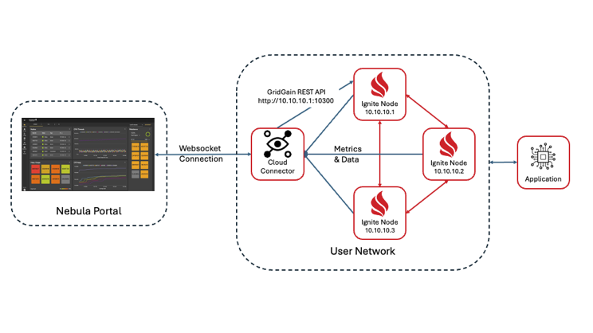
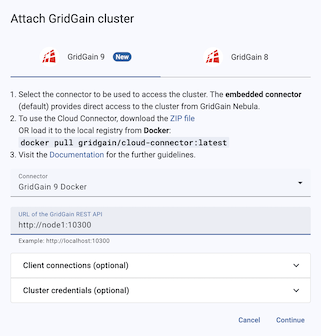
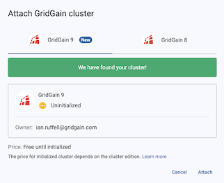

# GridGain Technology Primer
##Key Design Principles for Building Data-Intensive Applications

Welcome to the GridGain Acceleration Workshop! GridGain is an in-memory storage and computing platform that accelerates applications by providing in-memory distributed caching as well as processing, plus provides ACID transactions. This repository provides a practical introduction to GridGain, designed to help you explore its potential for enhancing application performance and scalability. Our goal is to demonstrate how GridGain can be effectively used in your project

This workshop, structured for both guided demonstrations and independent exploration, will walk you through key concepts and hands-on examples, allowing you to experience and apply GridGain's capabilities.

You might come across the names GridGain and Apache Ignite interchangeably. The GridGain platform is built on Apache Ignite. The source code for Apache Ignite was originally donated to the Apache Software Foundation by GridGain Systems. We will use the GridGain 9.0 platform in this workshop.

What You'll Learn
Throughout this workshop, you will gain hands-on experience with key GridGain 9 concepts and features:

* Data Storage
* Creating caches using SQL
* Understanding of data partitions
* Managing primary/affinity keys for optimal performance
* Querying and Analysis
* Writing SQL queries against distributed data
* Implementing complex joins and aggregations for operational insights
* Optimizing SQL queries
* Running MapReduce Job
* Creating compute task for distributed and parallel processing

## Prerequisites
* Java Developer Kit, version 11, 17 or 21
* Apache Maven 3.0 or later
* Docker
* Your favorite IDE, such as IntelliJ IDEA, or Eclipse, or a simple text editor.

## Clone The Project

1. Clone the training project with Git or download it as an archive:

    ```bash
    git clone -b gg9 https://github.com/GridGain-Demos/gridgain-technology-primer.git
    ```

2. (optionally), open the project in your favourite IDE such as IntelliJ or Eclipse, or just use a simple text editor
and command-line instructions prepared for all the samples. 

###If you are running on an ARM cpu architecture you can build your own container images

1. Download the latest GridGain DB & CLI distributions from;

	DB - [https://www.gridgain.com/media/gridgain9-db-9.0.16.zip](https://www.gridgain.com/media/gridgain9-db-9.0.16.zip)
	
	CLI - [https://www.gridgain.com/media/gridgain9-cli-9.0.16.zip](https://www.gridgain.com/media/gridgain9-cli-9.0.16.zip)

2. Unzip both files into ```{project root}/docker/dist```
3. Rename ```gridgain9-db-9.0.16``` to ```db```
4. Rename ```gridgain9-cli-9.0.16``` to ```cli```
5. Build the image

	```bash
	cd docker
	docker build . -t gridgain/gridgain9:9.0.16 -t gridgain/gridgain9:latest
	```

## Sign up for GridGain's Nebula service

We'll use the Control Center component to execute SQL queries and view cluster internals.

1. Open portal.gridgain.com in your browser
2. Click the "Sign up" button
3. Enter your details

## Configure the Cloud Connector



1. Open a terminal window and navigate to the root directory of this project.

1. Open `src/main/resources/cloud-connector.conf` in your IDE or text editor

	```
	# Connector configuration properties
	connector.cc-url   = https://portal.gridgain.com
	connector.base-url = http://cccc:3200
	connector.name     = GridGain 9 Docker
	connector.username = connector.username
	connector.password = connector.password
	```

1. Update the `connector.username` and `connector.password` values to the values you used to create your Nebula account.

## Starting the Cluster
### GridGain
	
Start your nodes using Docker Compose:
	
To use a specific GridGain Version (not needed for ***latest***);

```bash
export GRIDGAIN9_VERSION=9.0.16
```

then 

```
docker compose -f docker-compose.yml up
```
	   
or

###Ignite

Start your nodes using Docker Compose:
	
```bash
docker compose -f docker-compose-ignite.yml up
```

## Initialise the Cluster
5. Switch back to your browser and select `Attach GridGain`
6. In the "Connector" dropdown, select `GridGain 9 Docker`
7. The URL of the REST API is `http://node1:10300`

	
	
8. Click `Continue`

	

9. Click `Attach`
10. Initialise the cluster by clicking the `Initialise` button at the top-right of the screen

	
	
11. Set your Cluster name and add your license file if using GridGain, then click `Initialise`
 
## Creating Media Store Schema and Loading Data

Now you need to create a Media Store schema and load the cluster with sample data. Use SQLLine tool to achieve that:

1. Open a terminal window and navigate to the root directory of this project.
2. Load the media store database:
	
	a. Start the **GridGain** Command Line Interface (CLI)
	
    ```bash
   docker run -e LANG=C.UTF-8 -e LC_ALL=C.UTF-8 -v ./sql/media_store_create.sql:/opt/gridgain/sql/media_store_create.sql -v ./sql/media_store_populate.sql:/opt/gridgain/sql/media_store_populate.sql --rm --network gridgain9_default -it gridgain/gridgain9:latest cli
   ```
   
	Or start the **Ignite** Command Line Interface (CLI)
	
    ```bash
   docker run -e LANG=C.UTF-8 -e LC_ALL=C.UTF-8 -v ./config/media_store.sql:/opt/ignite/sql/media_store.sql --rm --network ignite3_default -it apacheignite/ignite:3.0.0 cli
   ```
   
   b. Connect to the cluster.

   ```bash
     __  ____/___________(_)______  /__  ____/______ ____(_)_______
	  _  / __  __  ___/__  / _  __  / _  / __  _  __ `/__  / __  __ \
	  / /_/ /  _  /    _  /  / /_/ /  / /_/ /  / /_/ / _  /  _  / / /
	  \____/   /_/     /_/   \_,__/   \____/   \__,_/  /_/   /_/ /_/
	                      GridGain CLI version 9.0.14
		
		
	You appear to have not connected to any node yet. Do you want to connect to the default node http://localhost:10300? [Y/n] 
   ```
   Do not be surprised if it does not connect you to the cluster even after selecting yes option. Explicityly connect to node1.
   ```bash
   connect http://node1:10300
   ```
   

   c. Execute SQL command to create the tables.
   
   **GridGain**
   
   ```bash
   sql --file=/opt/gridgain/sql/media_store_create.sql
    ```
	or
	
	**Ignite**
   
   ```bash
   sql --file=/opt/ignite/sql/media_store_create.sql
    ```
    
   c. Execute SQL command to load the sample data.

   **GridGain**

   ```bash
   sql --file=/opt/gridgain/sql/media_store_populate.sql
    ```
    
   or
   
   **Ignite**

   ```bash
   sql --file=/opt/ignite/sql/media_store_populate.sql
    ```

Keep the connection open as you'll use it for following exercises.

## Data Partitioning - Checking Data Distribution

With the Media Store database loaded, you can check how GridGain distributed the records within the cluster:

1. Switch to your browser and select the "Tables" tab
2. While on that screen, follow the instructor to learn some insights.

## Affinity Co-location - Optimizing Complex SQL Queries With JOINs

GridGain supports SQL for data processing including distributed joins, grouping and sorting. In this section, you're 
going to run basic SQL operations as well as more advanced ones.

### Querying Single Table

1. In your browser, select the "Queries" tab

2. Run the following query to find top-20 longest tracks:

    ```sql
    SELECT trackid, name, MAX(milliseconds / (1000 * 60)) as duration FROM track
    WHERE genreId < 17
    GROUP BY trackid, name ORDER BY duration DESC LIMIT 20;
    ```

### Joining Two Colocated Tables

1. Modify the previous query by adding information about an author. You do this by doing a LEFT
JOIN with the `Artist` table:

    ```sql
   SELECT track.trackId, track.name as track_name, genre.name as genre, artist.name as artist,
   MAX(milliseconds / (1000 * 60)) as duration FROM track
   LEFT JOIN artist ON track.artistId = artist.artistId
   JOIN genre ON track.genreId = genre.genreId
   WHERE track.genreId < 17
   GROUP BY track.trackId, track.name, genre.name, artist.name ORDER BY duration DESC LIMIT 20;
   ```

2. Try adding the phrase "EXPLAIN PLAN FOR" at the beginning of the above query to see how GridGain will execute it.
3. Examine the output. Your instructor will give hints for what to look for. It will look something like this:

	```bash
	Limit(fetch=[20]): rowcount = 20.0, cumulative cost = GridGainCost [rowCount=15318.06, cpu=77499.96615043783, memory=33461.76, io=178134.0, network=101068.0], id = 35293  
	```

## Co-located Compute Tasks

What is Collocation of Data and Compute?
Collocation of data and compute in GridGain means executing computations on the same nodes where the relevant data is stored. Instead of moving data across the network to a central processing unit, Ignite brings processing closer to the data, reducing latency and network overhead while improving overall performance.

1. Traditional Compute Model (Without Collocation)

	❌ Inefficient Data Movement

1. The application requests data from multiple nodes.
1. Data is transferred over the network to a central processing unit.
Computation is done remotely, introducing latency and bottlenecks.

## Running Co-located Compute Tasks

Run `training.ComputeApp` that uses Apache GridGain compute capabilities for a calculation of top-5 paying customers.
The compute task executes on every cluster node, iterates through local records and responds to the application that 
merges partial results.

1. Build an executable JAR with the applications' classes (or just start the app with IntelliJ IDEA or Eclipse):

	**GridGain**

    ```bash
    mvn clean package 
    ```
    
    or
    
    **Ignite**

    ```bash
    mvn -p ignite clean package 
    ```
    
2. Load the code into your cluster:

	a. Start the CLI.
	
	**GridGain**

    ```bash
   docker run -e LANG=C.UTF-8 -e LC_ALL=C.UTF-8 -v ./target/gridgain-technology-primer-1.0-SNAPSHOT.jar:/opt/gridgain/downloads/gridgain-technology-primer-1.0-SNAPSHOT.jar --rm --network GridGain3_default -it gridgain/gridgain:latest cli
   ```
   
   or
  
   **Ignite**
   
   ```bash
   docker run -e LANG=C.UTF-8 -e LC_ALL=C.UTF-8 -v ./target/gridgain-technology-primer-1.0-SNAPSHOT.jar:/opt/ignite/downloads/gridgain-technology-primer-1.0-SNAPSHOT.jar --rm --network GridGain3_default -it apacheignite/ignite:3.0.0 cli
   ```

	b. Connect to the cluster.
	
	```bash
   connect http://node1:10300
   ```
   
   c. Deploy the code to the cluster.
   
	**GridGain**

   ```bash
   cluster unit deploy --version 1.0.0 --path=/opt/gridgain/downloads/gridgain-technology-primer-1.0-SNAPSHOT.jar essentialsCompute
    ```
   
   or
   
   **Ignite**
   
   ```bash
   cluster unit deploy --version 1.0.0 --path=/opt/ignite/downloads/gridgain-technology-primer-1.0-SNAPSHOT.jar essentialsCompute
    ```

3. Execute the `ComputeApp` program from your IDE. 
