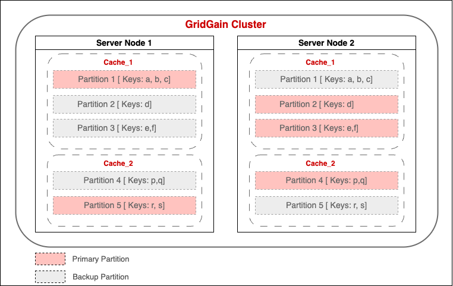

# GridGain Acceleration Workshop: Concepts to Practical Mastery

Welcome to the GridGain Acceleration Workshop! GridGain is an in-memory storage and computing platform that accelerates applications by providing in-memory distributed caching as well as processing, plus provides ACID transactions. This repository provides a practical introduction to GridGain, designed to help you explore its potential for enhancing application performance and scalability. Our goal is to demonstrate how GridGain can be effectively utilized within your project. This workshop, structured for both guided demonstrations and independent exploration, will walk you through key concepts and hands-on examples, allowing you to experience and apply GridGain's capabilities.

You might come across the names GridGain and Apache Ignite interchangeably. The GridGain platform is built on Apache Ignite. The source code for Apache Ignite was originally contributed to the Apache Software Foundation by GridGain Systems. We will use the Community Edtion(CE) of GridGain platform in this workshop. The GridGain Community Edition is a source-available version of Apache Ignite which includes patches and updates not yet included in Ignite.

## What You'll Learn

Throughout this workshop, you will gain hands-on experience with key GridGain 8 concepts and features:

### Data Storage

- Creating caches using SQL
- Understanding of data partitions
- Managing primary/affinity keys for optimal performance

### Querying and Analysis

- Writing SQL queries against distributed data
- Implementing complex joins operational insights
- Optimizing SQL queries

### Running MapReduce Job

- Creating compute task for distributed and parallel processing

> [!tip]
> Each module builds upon the previous one, with clear checkpoints to validate your progress. Therefore, it is highly recommended to follow the steps in the given order.

## Prerequisites

Before starting this tutorial, please ensure you have:

- **Java 11 or later** installed and properly configured
  - Verify with `java --version` in your terminal
- **Maven 3.6+** for dependency management
  - Verify with `mvn --version`
- **IDE** such as Eclipse or IntelliJ IDEA or VS Code with Java extensions
- **Basic Java knowledge**, including familiarity with classes and interfaces
- **Some SQL experience** for understanding the query examples

> [!important]
> **Checkpoint:** Before proceeding, verify you have all the prerequisites installed by running the version check commands listed above. Each should return version information rather than "command not found" errors.

#### Introduction to Frequently Used Terminologies
* __Server Node__ - A server node is the base computational and data storage unit in GridGain. Typically, you start a single server node per machine or container.
* __GridGain Cluster__ - A cluster is a group of server nodes interconnected together in order to provide shared resources like RAM and CPU to your applications.
* __Client Node__ - Client nodes are connection endpoints and gateways from the application layer to the cluster of GridGain server nodes. You always embed a client into your application code and execute required APIs. 
* __Control Center__ - It is a management and monitoring tool for GridGain and Apache Ignite clusters. It features a graphical user interface that helps you perform administrative tasks and monitor your clusters.
* __GridGain Nebula__ - It is a cloud-native, fully-managed service for the Apache Ignite and GridGain platforms. You can spin up Ignite/GridGain cluster in Nebula. Or you can use Nebula Control Center, while running your Ignite/GridGain cluster locally or on public/private cloud.
* __Cache__ - Cache is a high-speed data storage layer. It is a collection of key-value pairs that can be accessed through the key-value API.
* __Table__ - Table in GridGain corresponds to the notion of tables in traditional RDBMSs with some additional criteria; for example, each SQL table must have a primary key. SQL tables support traditional SQL syntax. Tables and caches are like two views of the same data.
* __Data Partitioning__ - It is a method of subdividing large sets of data into smaller chunks and distributing them between all server nodes in a balanced manner.
* __Partitioned Cache Mode__ - All partitions are split equally between all server nodes. This mode is the most scalable mode as more the nodes you have, the more data you can store.
* __Replicated Cache Mode__ - All the data (every partition) is replicated to every node in the cluster. This mode provides the high availability of data. 
* __Compute Task__ - The ComputeTask interface in GridGain provides fine-grained control over job distribution and custom fail-over logic, allowing developers to implement complex distributed algorithms, enabling massive parallel processing and efficient handling of large datasets. GridGain provides a simplified MapReduce API for it.

Here is a diagram that illustrates a 2-node GridGain cluster with two caches in partitioned mode. It is provided as a simplified example to help understand data partitioning and may not represent the actual distribution of data in a real cluster.

    

  

## Step-by-step Guide
Follow the instruction in each of these sections in the given order:
- [Project Setup and Cluster Creation](docs/Setup.md)
- [Connect to GridGain Control Center](docs/ControlCenter.md)
- [Load Data in GridGain Cluster](docs/LoadData.md)
- [Observe Data Distribution](docs/PartitionedData.md)
- [Distribute and Run Computation Task](docs/ComputeTask.md)
- [Running SQL Queries on GridGain Data](docs/SQLqueries.md)
- [Optimizing SQL Joins by Colocating Data](docs/Affinity.md)

## We Covered the Basics
By following the above steps, you got an overview of how data is stored in GridGain cluster(distributed across the nodes and partitioned), how you can enforce certain related records of more than one cache to reside on the same node(using affinity key; and the affinity key should be a part of the primary key), how we can perform colocated joins and how can we distribute a compute task across all the nodes.

We hope you enjoyed the workshop. Happy learning!
