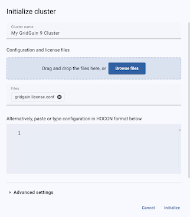

# GridGain Technology Primer
##Key Design Principles for Building Data-Intensive Applications


## Prerequisites

* Java Developer Kit, version 11, 17 or 21
* Apache Maven 3.0 or later
* Docker
* Your favorite IDE, such as IntelliJ IDEA, or Eclipse, or a simple text editor.

## Clone The Project

1. Clone the training project with Git or download it as an archive:

    ```bash
    git clone -b gg9 https://github.com/GridGain-Demos/gridgain-technology-primer.git
    ```

2. (optionally), open the project in your favourite IDE such as IntelliJ or Eclipse, or just use a simple text editor
and command-line instructions prepared for all the samples.    

## Sign up for GridGain's Nebula service

We'll use the Control Center component to execute SQL queries and view cluster internals.

1. Open portal.gridgain.com in your browser
2. Click the "Sign up" button
3. Enter your details

## Starting GridGain Cluster

Start a three-node GridGain cluster:

1. Open a terminal window and navigate to the root directory of this project.

2. Open `src/main/resources/cloud-connector.conf` in your IDE or text editor

	```hcon
	# Connector configuration properties
	connector.cc-url   = https://portal.gridgain.com
	connector.base-url = http://cccc:3200
	connector.name     = GridGain 9 Docker
	connector.username = connector.username
	connector.password = connector.password
	```

3. Update the `connector.username` and `connector.password` values to the values you used to create your Nebula account.

4. Start your nodes using Docker Compose:

    ```bash
   docker compose -f docker-compose.yml up
   ```

5. Switch back to your browser and select `Attach GridGain`
6. In the "Connector" dropdown, select `GridGain 9 Docker`
7. The URL of the REST API is `http://node1:10300`

	
	
8. Click `Continue`

	

9. Click `Attach`
10. Initialise the cluster by clicking the `Initialise` button at the top-right of the screen

	
	
11. Set your Cluster name and add your license file, then click `Initialise`
 
## Creating Media Store Schema and Loading Data

Now you need to create a Media Store schema and load the cluster with sample data. Use SQLLine tool to achieve that:

1. Open a terminal window and navigate to the root directory of this project.
2. Load the media store database:
	
	a. Start the Command Line Interface (CLI)
	
    ```bash
   docker run -e LANG=C.UTF-8 -e LC_ALL=C.UTF-8 -v ./sql/media_store_create.sql:/opt/gridgain/sql/media_store_create.sql -v ./sql/media_store_populate.sql:/opt/gridgain/sql/media_store_populate.sql --rm --network gridgain9_default -it gridgain/gridgain9:latest cli
   ```
   
   b. Connect to the cluster.

   ```bash
     __  ____/___________(_)______  /__  ____/______ ____(_)_______
	  _  / __  __  ___/__  / _  __  / _  / __  _  __ `/__  / __  __ \
	  / /_/ /  _  /    _  /  / /_/ /  / /_/ /  / /_/ / _  /  _  / / /
	  \____/   /_/     /_/   \_,__/   \____/   \__,_/  /_/   /_/ /_/
	                      GridGain CLI version 9.0.14
		
		
	You appear to have not connected to any node yet. Do you want to connect to the default node http://localhost:10300? [Y/n] 

   connect http://node1:10300
   ```
   
   c. Execute SQL command to create the tables.
   
   ```bash
   sql --file=/opt/gridgain/sql/media_store_create.sql
    ```
    
   c. Execute SQL command to load the sample data.

   ```bash
   sql --file=/opt/gridgain/sql/media_store_populate.sql
    ```

Keep the connection open as you'll use it for following exercises.

## Data Partitioning - Checking Data Distribution

With the Media Store database loaded, you can check how GridGain distributed the records within the cluster:

1. Switch to your browser and select the "Tables" tab
2. While on that screen, follow the instructor to learn some insights.

## Affinity Co-location - Optimizing Complex SQL Queries With JOINs

GridGain supports SQL for data processing including distributed joins, grouping and sorting. In this section, you're 
going to run basic SQL operations as well as more advanced ones.

### Querying Single Table

1. In your browser, select the "Queries" tab

2. Run the following query to find top-20 longest tracks:

    ```sql
    SELECT trackid, name, MAX(milliseconds / (1000 * 60)) as duration FROM track
    WHERE genreId < 17
    GROUP BY trackid, name ORDER BY duration DESC LIMIT 20;
    ```

### Joining Two Colocated Tables

1. Modify the previous query by adding information about an author. You do this by doing a LEFT
JOIN with the `Artist` table:

    ```sql
   SELECT track.trackId, track.name as track_name, genre.name as genre, artist.name as artist,
   MAX(milliseconds / (1000 * 60)) as duration FROM track
   LEFT JOIN artist ON track.artistId = artist.artistId
   JOIN genre ON track.genreId = genre.genreId
   WHERE track.genreId < 17
   GROUP BY track.trackId, track.name, genre.name, artist.name ORDER BY duration DESC LIMIT 20;
   ```

2. Try adding the phrase "EXPLAIN PLAN FOR" at the beginning of the above query to see how GridGain will execute it.
3. Examine the output. Your instructor will give hints for what to look for. It will look something like this:

	```bash
	Limit(fetch=[20]): rowcount = 20.0, cumulative cost = GridGainCost [rowCount=15318.06, cpu=77499.96615043783, memory=33461.76, io=178134.0, network=101068.0], id = 35293  
	```

## Running Co-located Compute Tasks

Run `training.ComputeApp` that uses Apache GridGain compute capabilities for a calculation of top-5 paying customers.
The compute task executes on every cluster node, iterates through local records and responds to the application that 
merges partial results.

1. Build an executable JAR with the applications' classes (or just start the app with IntelliJ IDEA or Eclipse):

    ```bash
    mvn clean package 
    ```
2. Load the code into your cluster:

	a. Start the CLI.

    ```bash
   docker run -e LANG=C.UTF-8 -e LC_ALL=C.UTF-8 -v ./target/GridGain-essentials-developer-training-1.0-SNAPSHOT.jar:/opt/GridGain/downloads/GridGain-essentials-developer-training-1.0-SNAPSHOT.jar --rm --network GridGain3_default -it apacheGridGain/GridGain:3.0.0 cli
   ```

	b. Connect to the cluster.
	
	```bash
   connect http://node1:10300
   ```
   
   c. Deploy the code to the cluster.
   
   ```bash
   cluster unit deploy --version 1.0.0 --path=/opt/GridGain/downloads/GridGain-essentials-developer-training-1.0-SNAPSHOT.jar essentialsCompute
    ```
3. Execute the `ComputeApp` program from your IDE. 
