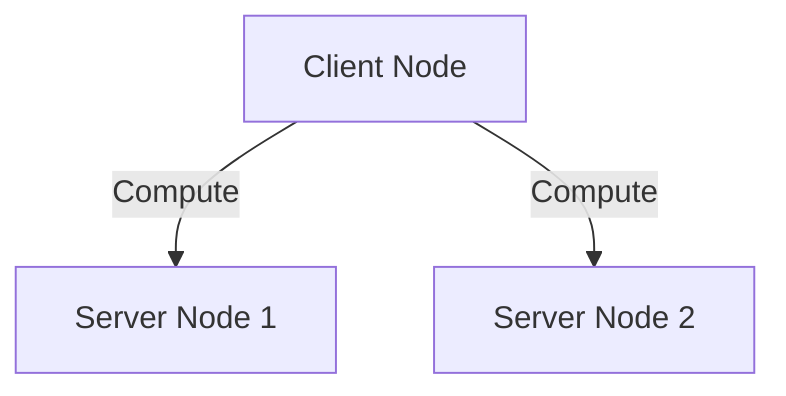
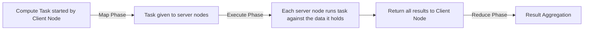

## 5. Running Distributed Compute Tasks

Run `org.gridgain.app.ComputeApp` that uses Apache Ignite compute capabilities for the calculation of top-5 paying customers.
The compute task executes on every cluster node. It iterates through local records and responds to the application that 
merges partial results.

> [!note]
> - __Compute Task__ interface in GridGain provides fine-grained control over job distribution and custom fail-over logic, allowing developers to implement complex distributed algorithms, enabling massive parallel processing and efficient handling of large datasets. GridGain provides a simplified MapReduce API for it.
> - __MapReduce__ is a distributed computation model where the "map" phase processes data in parallel across multiple nodes, and the "reduce" phase aggregates the results to produce a final output. It allows large-scale data processing efficiently within a GridGain cluster.

1. In the earlier step of building the project, you can observe 2 jars being built in the libs folder of the project. We will now work with the apps.jar in this section.

2. Run the app in the terminal:
    <pre><code>java -cp libs/apps.jar:libs/core.jar org.gridgain.app.ComputeApp</code></pre>
    
You can see the overall result i.e. the top 5 highest paying customers on the same terminal (observe that some computations also be happened on this terminal locally and then the cumulative results are shown):

On the dashboard, you can see the thick client count goes from 0 to 1. Note that the thin client count 1 is the SQLLine client connected to the cluster.

You can see the compute tasks under the "Compute" section of the portal.

3. Check the logs of the `ServerStartup` processes (your GridGain server nodes) to see that the calculation
was executed across the cluster.

You can notice that the computation has happened on all the server nodes (client node has done the job of aggregating the results sent by each of the server nodes).

> [!note]
> - __Thick clients__ (client nodes) join the cluster via an internal protocol, receive all of the cluster-wide updates such as topology changes, are aware of data distribution, and can direct a query/operation to a server node that owns a required data set. Plus, thick clients support all of the GridGain APIs. They are very similar to server nodes; the main difference being that thick clients do not store any data.
> - __Thin clients__ (lightweight clients) connect to the cluster using the binary protocol with a well-defined message format. While this type of client supports a more limited set of APIs, it offers the advantage of being able to work with a wide range of programming languages, without being restricted to just a few.

> [!note]
> Was it possible to start a server node instead of a client node for running the compute task? Yes. The class `Appconfiguration` constructor takes a boolen value variable `isClient` which is being used in `setClientMode()`. From the `ComputeApp` constructor, we are passing `true` value of `isClient`, which tells that this new node has to start as a client node.

> [!tip]
> What would have happened if we had started the ComputeApp as a server node? It would have assumed responsibility for storing data and triggered the redistribution (rebalancing) of the already stored data.

What exactly did the client node do? It distributed the task to the server nodes so that each server node could execute the task against the data it holds.

The server nodes executed the task at their ends and sent the results back to the client node. Client node aggregated the results and showed it. Here is a simplified flow of the sub-tasks:

#### Modify the computation logic: 

1. Update the logic to return top-10 paying customers (Hint: Modify the variable `customersCount` value in `ComputeApp.java`).

2. Re-build an executable JAR with the applications' classes (or just start the app with IntelliJ IDEA or Eclipse):
    <pre><code>mvn clean package </code></pre>
    
3. Run the app again:
    <pre><code>java -cp libs/apps.jar:libs/core.jar org.gridgain.app.ComputeApp</code></pre>
    
Observe the terminals where server nodes are running as well as the one where client node is running.

Task for self-exploration: Try the same exercise by making this third node as a client node and observe which computations happen on which nodes. For being able to call `setClientApp(true`, pass `true` while creating a new instance of AppConfiguration in the constructor of ComputeApp class, (Currently, no parameter has been passed, which ultimately leads to `setClientApp(false)`).

## Code Deployment on Nebula
If you are using GridGain Nebula for spinning up GridGain cluster, or Nebula just for Control Center, you can use the Code Deployment from the UI. Upload the `apps.jar` and deploy it. 

> [!important]
> **Checkpoint:** Compute page on the Control Center should show the compute task with its status as `Finished`.

Next Step: [Running SQL Queries on GridGain Data](SQLqueries.md)

Back to the [Main Page](../README.md/#step-by-step-guide)
